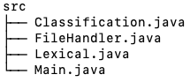
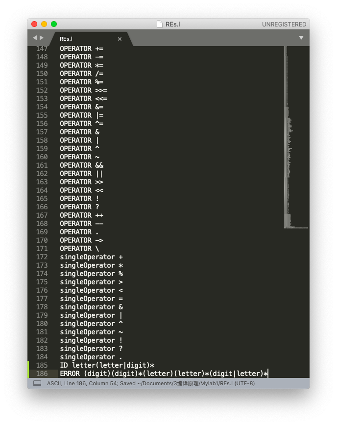
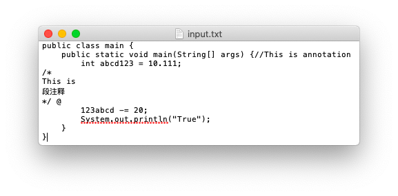

# LEX 词法分析实验报告

赵茁羽 171250006

[toc]

### 1. 实验环境

使用 java 语言

### 2. src目录文件



### 3. 情况截图

#### 3.1 REs.l 文件截图



#### 3.2 输入文件截图



#### 3.3 输出文件截图


#### 3.4 控制台输出截图


### 4. RE 定义

具体内容参考 REs.l 文件

| Token           | RE                                 | 包含内容             |
| --------------- | ---------------------------------- | -------------------- |
| INT             | (ε\|-)digit(digit)*                | 整数型数字，含负数   |
| FLOAT           | (ε\|-)digit(digit)\*.digit(digit)* | 浮点数型数字，含负数 |
| SEPARATOR       | ,\|;\|(\|)\|[\|]\|{\|}......       | 分割符               |
| OPERATOR        | +\|-\|......                       | 操作符               |
| ANNOTATION      | (//)\|(/\*)\|(*/)                  | 注释符               |
| ANNOTATION TEXT | 任意                               | 注释内容             |
| KEYWORD         | public\|private......              | 关键字               |
| ID              | letter(letter\|digit)*             | 自定义标识符         |

*digit=[0-9]  letter=[a-zA-Z]*

SEPARATOR 分隔符具体内容：

> ,，:，;，(，)，[，]，{，}，"，'

KEYWORD 关键字具体内容：

> public，private，protected，static，abstract，final，class，extends，implements，interface，native，static，strictfp，synchronized，transient，new，main，Main，System，out，println，print，args，break，continue，return，do，while，if，else，for，instanceof，switch，case，default，try，catch，throw，throws，import，package，true，false，int，char，boolean，byte，double，float，long，short，null，true，false，String，string，super，this，void，goto，const

OPERATOR 操作符具体内容：

> +，-，*，/，%，>，<，>=，<=，==，!=，=，+=，-=，*=，/=，%=，>>=，<<=，&=，|=，^=，&，|，^，~，&&，||，>>，<<，!，?，++，--，.，->，\

此外还定义了 singleOperator ，所有操作符都由以下单个字符组成，用来辅助判断多个符号组成的操作符，因为在 Lexical.java 文件中的主算法中为了判断注释和负数单独考虑了/和-的情况，此处不考虑这两个字符

> +，*，%，>，<，=，&，|，^，~，!，?，.

### 5. DFA 构造

#### 5.1 RE->NFA


#### 5.2 NFA->DFA

separator，operator，keyword，annotation 都可直接单字符匹配得到，如果出现多字符，加入缓存 word 中再将 word 与事先定义数组依次匹配即可得到，故在此不做处理

int 可通过取 float 前半部分得到，方法类似

故在此只处理 float 和 id 情况


| I<sub>i</sub>            | letter                | Digit                    | minus(-)          | dot(.)             |
| ------------------------ | --------------------- | ------------------------ | ----------------- | ------------------ |
| I<sub>0</sub>={1,5,6}    | I<sub>1</sub>={2,3,4} | I<sub>2</sub>={7,8,9}    | I<sub>3</sub>={6} | Ø                  |
| I<sub>1</sub>={2,3,4}    | I<sub>4</sub>={3,4}   | I<sub>4</sub>={3,4}      | Ø                 | Ø                  |
| I<sub>2</sub>={7,8,9}    | Ø                     | I<sub>5</sub>={8,9}      | Ø                 | I<sub>6</sub>={10} |
| I<sub>3</sub>={6}        | Ø                     | I<sub>2</sub>={7,8,9}    | Ø                 | Ø                  |
| I<sub>4</sub>={3,4}      | I<sub>4</sub>={3,4}   | I<sub>4</sub>={3,4}      | Ø                 | Ø                  |
| I<sub>5</sub>={8,9}      | Ø                     | I<sub>5</sub>={8,9}      | Ø                 | I<sub>6</sub>={10} |
| I<sub>6</sub>={10}       | Ø                     | I<sub>7</sub>={11,12,13} | Ø                 | Ø                  |
| I<sub>7</sub>={11,12,13} | Ø                     | I<sub>8</sub>={12,13}    | Ø                 | Ø                  |
| I<sub>8</sub>={12,13}    | Ø                     | I<sub>8</sub>={12,13}    | Ø                 | Ø                  |

#### 5.3 DFA优化


### 6.概要设计

#### 6.1 Classification.java

1. 主要功能：读取 REs.l 文件，将枚举内容添加进数组定义RE，进行类型判断

2. 数据结构

   ```java
   /* 具体内容在 4. RE 定义 中已给出*/
   //关键字数组，根据读取 REs.l 文件中开头为 KEYWORD 的内容动态添加
   public static ArrayList<String> keyword = new ArrayList<String>();
   //数字数组，根据读取 REs.l 文件中开头为 digit 的内容动态添加
   public static ArrayList<Character> digit = new ArrayList<Character>();
   //字母数组，根据读取 REs.l 文件中开头为 letter 的内容动态添加
   public static ArrayList<Character> letter = new ArrayList<Character>();
   //操作符数组，根据读取 REs.l 文件中开头为 OPERATOR 的内容动态添加
   public static ArrayList<String> operator = new ArrayList<String>();
   //单操作符数组，根据读取 REs.l 文件中开头为 singleOperator 的内容动态添加
   public static ArrayList<Character> singleOperator = new ArrayList<Character>();
   //分隔符数组，根据读取 REs.l 文件中开头为 SEPARATOR 的内容动态添加
   public static ArrayList<Character> separator = new ArrayList<Character>();
   ```

3. 主要方法

   1. void readLex()：按行读取 REs.l 文件，按空格分割为两项，第一项匹对类别，第二项把内容赋给响应类
   2. boolean isKeyword(String ch)：判断字符串是否是关键字
   3. boolean isDigit(char ch)：判断字符是否是数字
   4. boolean isLetter(char ch)：判断字符是否是字母
   5. boolean isOperator(String ch)：判断字符串是否是操作符
   6. boolean isSingleOperator(char ch)：判断字符是否是单个操作符
   7. boolean isSeparator(char ch)：判断字符是否是分隔符

#### 6.2 FileHandler.java

1. 主要功能：进行文件读取写入处理
2. 主要方法
   1. StringBuffer readFile()：按字符读文件至缓存，返回缓存
   2. void writeFile(String content)：出入结果，将结果写入文件

#### 6.3 Lexical.java

1. 主要功能：主要算法处理

2. 数据结构

   ```java
   /* Lexical.java */
   private StringBuffer buffer;//文件内容
   private Classification cf;
   private FileHandler fh;
   private StringBuffer word;//记录输入字符串，如+=,abcd,123
   private STATE state;
   private int isError = 0;//判断是否是异常输入，如 1234abc
   private StringBuffer errorWord;//记录异常输入字符串
   
   enum STATE {
           NORMAL,//正常情况
           MINUS,//负号 -int -float -separator 
           DIGIT, //数字 -int -float
           FLOAT,//浮点数
           LETTER, //字母 -keyword -ID
           SEPARATOR,//分割符
           OPERATOR,//操作符
           ANNOTATION_PRE,//斜线 / -行注释 -段注释 -operator
           LINE_ANNOTATION,//行注释
           SEGMENT_ANNOTATION_PRE,//星号/* -段注释
           SEGMENT_ANNOTATION,//段注释
       }
   ```

3. 主要方法

   1. analyzeState()：通过while 实现字符遍历，通过switch-case 实现状态判断

#### 6.4 Main.java

1. 主要功能：读取用户输入文件名，运行主程序
2. 主要方法
   1. main()：提示用户输入文件名，运行处理算法

### 7. 实验思路

1. 定义自己的 .l 文件，digit(数字)、letter(字母)、separator(分隔符)、operator(操作符)、singleOperator(单个操作符)、keyword(关键字) 采用枚举方式列出，ID、error(数字后接字母的错误输入)、int(整数)、float(浮点数) 采用正则表达式方式列出
2. 手动进行 RE 转 NFA，NFA 转 DFA，DFA 优化过程，至此准备工作完成
3. 用户输入文件名，将文本文件中的内容按字节读取存入 StringBuffer buffer 中
4. 初始化 state 为 normal，遍历 buffer，将当前字符存储至 char ch，当前 state 代表前一个字符的状态，StringBuffer word 存储当前读入的一个词法单元
5. 通过 switch 判断状态
   1. 如果是 LETTER，那么读取字符一直到不是 LETTER 或 DIGIT 为止，每读一个字符就存入 word 缓存，然后判断是不是keyword，如果不是则说明是 ID，之后清空读入缓存 word，向文件写入输出内容，state 赋值为 NORMAL
   2. 如果是 MINUS(-)，那么读取下一个字符，如果是数字将 state 赋为DIGIT，如果不是说明为操作符，赋为 OPERATOR
   3. 如果是 DIGIT，那么一直读取到不是 DIGIT 为止，每读一个字符存储到 word 缓存，如果读到`.`，说明可能是浮点数，转入 FLOAT，继续读到不是 DIGIT 为止，如果读到 LETTER 说明是异常状态，具体处理过程在 **8. 异常情况处理** 中叙述
   4. 如果是 OPERATOR，那么读取字符到不是 singleOperator 为止，每读一个字符就存入 word 缓存，然后判断是不是 operator
   5. 依次判断其他情况，同上
6. 如果遇到异常情况，在终端报错
7. 结束

### 8. 异常情况处理

错误情况会在终端提示错误，输出文件中不会有表现

1. 遇到无法识别的字符：输出`Can't recognize 无法识别的字符`

2. 未找到输入文件：输出`输入文件名 is not found`

3. 除注释内容外，数字后面出现字符视为错误：如出现 123abc 情况，输出`ERROR FORMAT: 123abc`

   其实如果这种情况出现在引号内也是可以的，但是并没有单独为引号建立状态，所以暂不考虑
   
   处理办法：单独定义 errorWord ,  isError，当数字后出现字母时，将 isError 赋值为 1，当前字符内容复制给 errorWord，每次读取字母时首先判断isError 是否为 1，如果是错误状态，当前字符添加到 errorWord 后，全部读取后输出，并初始化 errorWord，isError 和 word，如果读取字母时不是错误状态，正常读取。
   
   因为这种情况是程序完成后完善时考虑加上的，所以从 RE 到 DFA 优化的过程单独进行了一遍，之后再加入到程序中
   
   3.1 RE->NFA
   
   RE --> (digit)(digit)*(letter)(letter)\*(digit|letter)\*
   
   
   
   3.2 NFA->DFA
   
   | I<sub>i</sub>             | letter                    | Digit                 |
   | ------------------------- | ------------------------- | --------------------- |
   | I<sub>0</sub>={1}         | Ø                         | I<sub>1</sub>={2,3,4} |
   | I<sub>1</sub>={2,3,4}     | I<sub>3</sub>={5,6,7,8,9} | I<sub>2</sub>={3,4}   |
   | I<sub>2</sub>={3,4}       | I<sub>3</sub>={5,6,7,8,9} | I<sub>2</sub>={3,4}   |
   | I<sub>3</sub>={5,6,7,8,9} | I<sub>4</sub>={6,7,8,9}   | I<sub>5</sub>={8,9}   |
   | I<sub>4</sub>={6,7,8,9}   | I<sub>4</sub>={6,7,8,9}   | I<sub>5</sub>={8,9}   |
   | I<sub>5</sub>={8,9}       | I<sub>5</sub>={8,9}       | I<sub>5</sub>={8,9}   |
   
   3.3 DFA 优化
   
   

### 9. 相关问题及解决办法

1. 一开始没有思路，拿到题目完全不知道怎么下手，后来老师课上把实验过程捋了一遍就比较清晰了。

2. 在完成实验过程中主要是关于 .l 文件的相关作业要求不太理解，不知道此文件有什么作用、文件中内容怎么定义和处理，此处参考了老师提供的 MiniCCompiler 项目，最后也不太清楚自己的处理方法是不是符合题目要求 

### 10. 实验感想

因为临近期末考试且课业压力较大，没能深入研究还是比较遗憾的，只实现了手动 DFA 过程，异常情况处理考虑的也较少。在编程过程中又复习了一遍 DFA 知识，加深了理解，之前总觉得这门课太理论，这次实验后也多了解了些编译原理的应用。