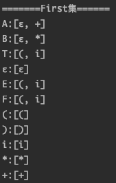

# 语法分析实验报告

> 赵茁羽 171250006

[toc]

## 1. 相关截图

### 1.1 input.txt


### 1.2 控制台输出


### 1.3 Output.txt


### 1.4 src文件目录


## 2. 实验简介

### 2.1 实验目的

使用 java 语言构建 LL(1) 语法分析器

### 2.2 实验描述

产生式存储在 input.txt 中，通过控制台输入待预测字符串，将分析过程和最终结果输出在控制台，最后保存至 output.txt

### 2.3 输入假设

1. input.txt 中输入的应是已经过预处理的上下文无关文法
2. 只支持一个字符的非终结符，如 S' 不支持

## 3. 算法思路

### 3.1 构造产生式

按行读取文件内容，将大写字母归于非终结符，小写字母和自定义终结符列表 operator 中的字符归于非终结符，最终判断并生成终结符集合terminal、非终结符集合nonterminal、产生式字符数组 production

遇到"|"需要将左右拆分成两条产生式

### 3.2 构造 First 集

为所有终结符和非终结符构造 First 集

对 A 的 First 集，遍历以 A 开头的所有产生式

如果产生式右端第一个字符为终结符，直接添加至该字符的 First 集

如果产生式右端为空字符串ε，直接添加至该字符的 First 集

如果产生式右端为非终结符，从左往右遍历产生式右端，求该非终结符的 First 集，将该非终结符的 First 集加入原字符 First 集

### 3.3 构造 Follow 集

为所有非终结符构造 Follow 集

先将$添加至所有非终结符的 Follow 集中

遍历以 A 开头的所有产生式，从右往左扫描非终结符B，把非终结符左边一位看做 a，右边一位看做 b

对产生式 A->aBb，把 First(b)-{ε}加至 Follow(B)中

对产生式 A->aBb, 如果 b 能推导 ε，即 ε∈First(a)，把 Follow(A)添加到 Follow(B)中

对产生式 A->aB，把 Follow(A)添加到 Follow(B)中

因为位于前面的终结符在计算过程中会用到后面的产生式，第一次进行以上计算时可能并没有求全，需要重复两次以上过程确保 Follow 集计算完整

### 3.4 构造预测分析表

初始化预测分析表，行为非终结符和$，列为终结符，交叉项为产生式，一开始全置为"/"

遍历所有产生式，对于左端为非终结符 A 的产生式

如果A推出 ε，需要用到 Follow 集，查找 A 的 Follow 集填入表格

如果A推出终结符，直接填入表格

剩余产生式情况查找 A 的 First 集填入表格

### 3.5 执行分析

在输入字符串末尾加上 $ 作为结束符标志

先将$和开始符入栈，栈顶符号为 X，index 指向输入字符串的待分析符号 ch

如果栈为空，即X为$，说明分析结束停止分析

如果 X==ch 说明匹配，弹出栈顶符号，同时符号栈也弹出一个，index++，指向下一个符号

如果 X 是非终结符，查表看对应产生式，弹出栈顶符号，把此产生式右部符号从右往左进栈，如果是 ε 不需要进栈

## 4. 概要设计

### 4.1 数据结构

```java
/*考虑到终结符和非终结符中重复项需合并且对顺序没有要求所以用 HashSet 结构*/
public HashSet<Character> terminal = new HashSet<Character>();//终结符集合
public HashSet<Character> nonterminal = new HashSet<Character>();//非终结符集合
/*production[0] 为产生式->左端内容，剩余字符串为产生式右端*/
public ArrayList<String> production = new ArrayList<String>();//产生式集合
public static final char[] operator = {'+', '-', '*', '/', '%', '(', ')'};//自定义非终结符列表
/*Character为终结符和非终结符，HashSet 中存储了该字符的 first 集*/
public HashMap<Character, HashSet<Character>> first = new HashMap<Character, HashSet<Character>>();//first集
/*Character为非终结符，HashSet 中存储了该字符的 follow 集*/
public HashMap<Character, HashSet<Character>> follow = new HashMap<Character, HashSet<Character>>();//follow集
/*行为非终结符，列为终结符，行列交叉项为产生式，不存在产生式的用'/'表示*/
public String[][] table;//预测分析表
/*执行分析时使用的栈空间*/
public Stack<Character> stack = new Stack<Character>();//分析栈
```

### 4.2 主要方法

#### 4.2.1 analyzeProduction()

解析产生式

引用了自定义方法 isTerminal(char) 用于区分非终结符

#### 4.2.2 getFirst(char)

为所有终结符和非终结符计算 First 集，遍历终结符和非终结符集合依次传入

#### 4.2.3 getFollow(char)

为所有非终结符计算 Follow 集，遍历非终结符集合一次传入，一共调用两次确保计算完备

#### 4.2.4 getTable()

生成预测分析表，首先初始化首行首列，再将交叉项全部置为初始值，接着遍历所有产生式

引用了自定义方法 addTable(char, char, string) 用于将表达式写入预测分析表数组结构 table 中，传入第一项为非终结符，第二项为终结符，第三项为产生式右端

#### 4.2.5 analyze(string)

分析输入的字符串

引用了 search 方法用于查表

#### 4.2.6 Init()

引用了 analyzeProduction(), getFirst(char), getFollow(char), getTable() 进行准备环节

#### 4.2.7 printPre()

打印准备环节和分析过程

#### 4.2.8 WriteFile()

阻断控制台输出，将控制台输出内容保存至output.txt文件

## 5. 测试用例

### 5.1 用例1(匹配成功)

1. 上下文无关文法（见 input.txt 文件）

   

2. 待分析字符串(控制台输入)

   `i*i+i`

3. 程序解析输出

   以下内容全部输出到控制台和 output.txt 文件

   1. 产生式

      

   2. First 集

      

   3. Follow 集

      

   4. 预测分析表

      

   5. 执行分析

      

### 5.2 用例 2（匹配失败）

上下文无关文法同上，待分析字符串为 i*(a+i)，执行分析结果见下图


## 6. 异常情况处理

这次考虑的异常情况较少

1. input.txt 文件查找不到会报错

2. 解析字符串时未匹配到字符时会报错，如没有定义 a 

   

## 7. 相关问题及解决办法

一开始手算分析表比较熟练但是不太清楚如何程序实现，后来看了几遍龙书，发现上面讲的很清楚，FOLLOW 集合的处理方法和老师上课讲的在顺序上有点差异，龙书上的方法更适合程序遍历处理。

实验设计上在数据结构方面吃了很大亏，刚开始没有仔细考虑用的简单的字符串和数组比较难处理，后来重构成了 HashSet 和 HashMap ，代码量减小了不少，用 stack 处理分析过程也很方便。

在预测分析表的构造上卡得最久，一开始遇到一个非终结符对应多个产生式的情况，交叉项的产生式填写时总会被后遍历到的产生式覆盖，后来对产生式进行了分类，先处理了右端为空集ε和终结符的情况，再判断其他情况才解决。

残留问题：

对产生式的异常情况考虑不够，input.txt 中必须输入正确的上下文无关文法，需要手工对产生式进行提取最大左因子和消除左递归的预处理操作

## 8. 实验感想

这次实验整体来讲思路还是比较清晰的，有了第一次的经验，至少一开始不会也知道该向什么方向努力了，正好把 LL1 文法又巩固了一遍。